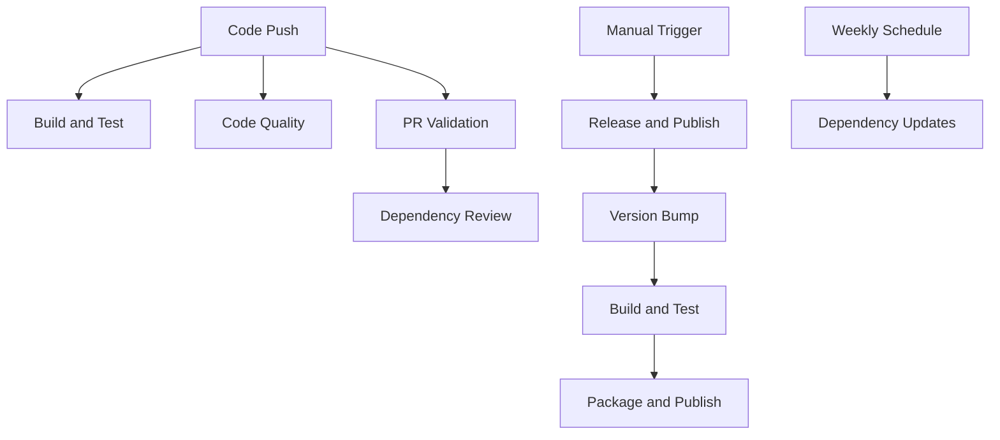

# GitHub Actions Workflows Documentation

This document describes the comprehensive GitHub Actions workflow suite for the Idasen Desk Core project.

## Overview

The project includes multiple workflows designed to provide complete automation for:
- **Building** the .NET solution
- **Testing** with comprehensive coverage
- **Version management** and releases
- **Code quality** analysis and security scanning
- **Dependency management** and security auditing

## Workflow Files

### 1. Build and Test (`ci.yml`)
**Triggers:** Push to main/develop, Pull Requests, Manual dispatch

**Purpose:** Core CI pipeline for building and testing the project

**Features:**
- Builds solution in both Debug and Release configurations
- Runs all unit tests (excluding integration tests)
- Generates test reports and code coverage
- Caches NuGet packages for performance
- Uploads test artifacts for review
- Windows-specific execution for Bluetooth LE compatibility

**Key Steps:**
1. Checkout code and setup .NET 8
2. Restore dependencies with caching
3. Build solution (Debug + Release)
4. Execute unit tests with coverage
5. Generate test reports and upload artifacts

### 2. Release and Publish (`release.yml`)
**Triggers:** Manual workflow dispatch with version bump options

**Purpose:** Automated versioning, building, testing, and publishing

**Features:**
- Intelligent version bumping (patch/minor/major/prerelease)
- Dry-run capability for testing
- Pre-release validation with full test suite
- NuGet package creation and publishing
- GitHub release creation with artifacts
- Automatic git tagging and commit

**Version Bump Types:**
- `patch`: 1.0.0 → 1.0.1
- `minor`: 1.0.0 → 1.1.0  
- `major`: 1.0.0 → 2.0.0
- `prerelease`: 1.0.0 → 1.0.0-beta.1

**Publishing Targets:**
- NuGet.org (requires `NUGET_API_KEY` secret)
- GitHub Packages
- GitHub Releases with auto-generated notes

### 3. Code Quality (`code-quality.yml`)
**Triggers:** Push to main/develop, Pull Requests, Manual dispatch

**Purpose:** Static code analysis and security scanning

**Features:**
- .NET code analysis with enhanced rules
- Code formatting validation
- Package license checking
- CodeQL security analysis
- Configurable analysis rules

**Analysis Types:**
- Static code analysis for quality issues
- Security vulnerability detection
- Code formatting standards compliance
- Dependency license compliance

### 4. Pull Request Validation (`pr-validation.yml`)
**Triggers:** Pull Request events (opened, updated, ready for review)

**Purpose:** Comprehensive PR validation and feedback

**Features:**
- Full build and test validation
- Breaking change detection
- PR size analysis and recommendations
- Test result reporting in PR comments
- Draft PR handling
- Artifact upload for review

**Validation Checks:**
- Build success in Release configuration
- All unit tests passing
- Public API change detection
- PR size recommendations (warns if >200 lines changed)

### 5. Dependency Updates (`dependency-update.yml`)
**Triggers:** Weekly schedule (Sundays), Manual dispatch

**Purpose:** Security and dependency management

**Features:**
- Weekly automated security audits
- Vulnerable package detection
- Dependency license review
- Package update recommendations
- Security severity analysis

**Security Checks:**
- NuGet package vulnerability scanning
- License compliance verification
- Transitive dependency analysis

### 6. Dependency Review (Integrated with PR Validation)
**Triggers:** Pull Requests

**Purpose:** Review dependency changes in PRs

**Features:**
- Automatic dependency change detection
- License compliance checking
- Security vulnerability blocking
- Configurable approval rules

## Configuration Files

### `.github/dependency-review-config.yml`
- Defines allowed/blocked licenses
- Security vulnerability thresholds  
- Package approval/denial rules

### `.github/codeql-config.yml`
- CodeQL security analysis configuration
- Query pack selection
- Path inclusion/exclusion rules

## Secrets Required

For full functionality, configure these repository secrets:

| Secret | Purpose | Required For |
|--------|---------|--------------|
| `NUGET_API_KEY` | Publishing to NuGet.org | Release workflow |
| `GITHUB_TOKEN` | GitHub API access | Auto-configured |

## Usage Examples

### Running a Release
1. Navigate to Actions tab
2. Select "Release and Publish" workflow  
3. Click "Run workflow"
4. Choose version bump type and options
5. Monitor progress and review generated release

### Monitoring Code Quality
- Code quality checks run automatically on every PR
- Review CodeQL security alerts in the Security tab
- Check dependency vulnerabilities weekly

### Troubleshooting Failed Builds
1. Check the build logs in the Actions tab
2. Download test result artifacts for detailed analysis
3. Review formatting issues with `dotnet format`
4. Address any security vulnerabilities identified

## Best Practices

1. **Always use Draft PRs** for work-in-progress to avoid triggering full validation
2. **Review dependency updates** weekly via the automated reports
3. **Use dry-run releases** to test version bumps without publishing
4. **Monitor security alerts** and address vulnerabilities promptly
5. **Keep PRs small** (under 200 lines changed when possible)

## Workflow Dependencies

## Maintenance

- Review and update workflow configurations quarterly
- Update .NET versions as new LTS versions are released
- Monitor GitHub Actions usage and optimize for cost/performance
- Keep action versions up to date for security and features

## Support

For issues with workflows:
1. Check the Actions tab for detailed logs
2. Review this documentation for configuration details
3. Consult GitHub Actions documentation for action-specific issues
4. Create an issue in the repository for workflow-related problems